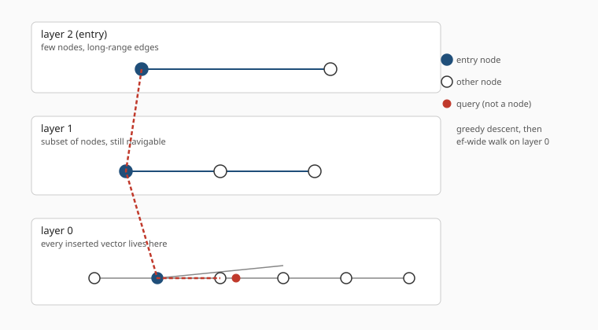
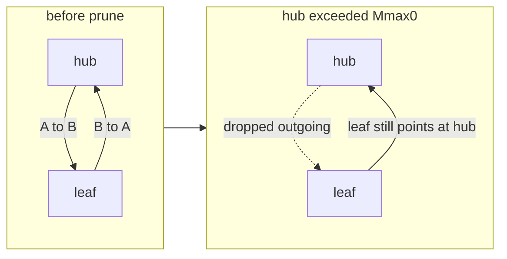
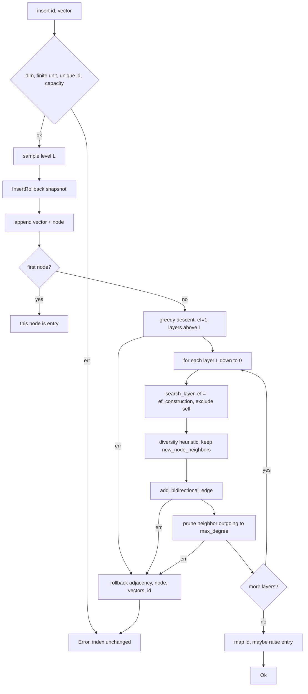
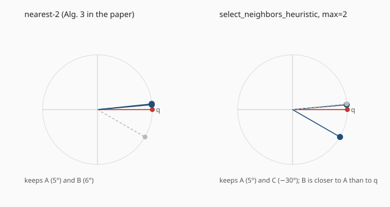
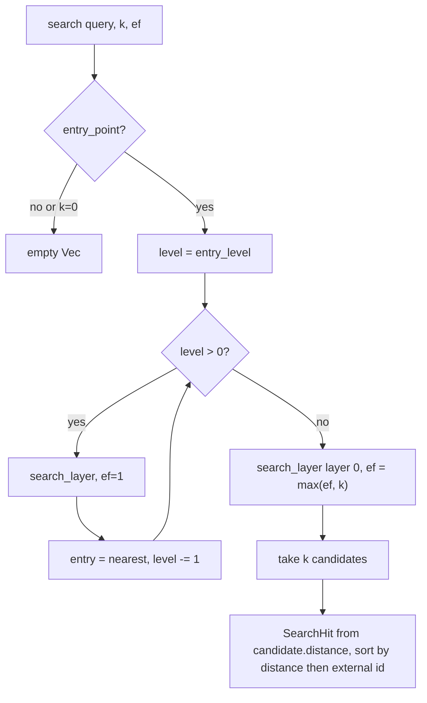
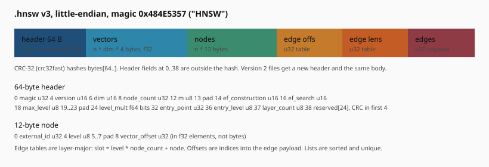

Bifrost is a Rust library for approximate k-nearest-neighbor search over unit-normalized `f32` vectors. The crate path is `bifrost`. `Cargo.toml` names the package `bifrost-index` 0.2.1, because `bifrost` was taken. I did not verify a crates.io publish from this tree; changelog still files 0.2.1 work under Unreleased. There is no server, no CLI, and no network protocol. You construct an `HnswIndex`, insert vectors under caller-chosen `u32` ids, search, and optionally write a memory-mapped `.hnsw` snapshot.

The algorithm is Hierarchical Navigable Small World, HNSW, as described by Yu. A. Malkov and D. A. Yashunin in [Efficient and robust approximate nearest neighbor search using Hierarchical Navigable Small World graphs](https://arxiv.org/abs/1603.09320). Neighbor selection, level sampling, and degree caps follow that paper and [hnswlib](https://github.com/nmslib/hnswlib). The README says this outright. The type is still `HnswIndex`. The on-disk magic is still `HNSW`. This article is about what the code in `klgraham/bifrost` on `main` (`3945cbc`) actually does. Numbers come from that tree. If a figure is missing there, it is missing here.

## Why exact k-NN is expensive

Given a collection of \(N\) vectors in \(\mathbb{R}^d\) and a query \(q\), exact k-NN returns the \(k\) stored vectors that minimize a distance \(d(q, v)\). The brute-force algorithm evaluates every stored vector. Cost is \(\Theta(N \cdot d)\) arithmetic plus a top-\(k\) selection. That is the ground truth the competitor bench in `benchmarks/competitors` computes: it dots every query against every corpus vector and keeps the \(k\) largest inner products.

For embedding search this is the wrong default once \(N\) leaves the toy range. A 384-dimensional index with tens of thousands of rows is already a lot of sequential dots per query. The usual response is an *index*: extra structure built once, then used to avoid looking at most of the corpus.

"Approximate" here is not a bound. HNSW does not prove that the returned set is within \(\varepsilon\) of the true neighbors, and this crate does not add such a proof. Approximate means the search walks a graph and may miss a true neighbor that sits in a region the walk never entered. Quality is empirical recall against exact search. The library tests enforce recall floors on small seeded graphs. They do not characterize production workloads.

## How a graph avoids scanning N vectors

Brute force has no structure. Every query starts from zero knowledge of the corpus. An index is a bet that geometry in the dataset is stable enough to precompute a map.

HNSW's map is a sparse graph whose edges prefer short distances, with a second, thinner graph on top whose edges jump farther. The paper's name for this is a navigable small world: from a node you can reach most other nodes in a small number of hops, and greedy choices, always stepping to the neighbor closest to the target, usually make progress.

That last word is doing a lot of work. Greedy search on a nearest-neighbor graph can get stuck. A node can be a local minimum for this query, closer than all of its neighbors, while a better vector sits in another cluster with no edge over. HNSW fights that in two ways this crate actually implements.

First, insertion does not keep the M nearest neighbors. It keeps a diverse subset, Algorithm 4, so a hub is less likely to point only into one tight clump. Second, search on upper layers is greedy with width 1, which is cheap long-range navigation, and search on layer 0 uses a wider candidate list `ef`, which is the budget you spend on not stopping at the first local minimum.

None of that is a recall proof. Malkov and Yashunin argue logarithmic scaling on some graph families. Bifrost does not re-derive it. It implements the construction and the walk, then tests recall on two seeded generators. Treat the polylog story as the paper's, and the floors 0.95 and 0.90 as this crate's.

The competitor bench still computes exact top-k the slow way, as `exact_top_k`, so a regression in the walk has something to fail against. That ground truth is inner product on pre-normalized vectors, equivalent to minimizing `1 - dot`.

## What the index is allowed to assume

Distance inside the index is cosine distance for *already normalized* vectors:

\[
d(a, b) = 1 - a \cdot b
\]

On the unit sphere this is 0 for identical vectors, 1 for orthogonal, 2 for opposites. The public helper `vector::cosine_distance` is exactly that. Insert and search do not re-normalize. They do not divide by norms. If you pass a vector with \(\|v\| \neq 1\), ranking silently uses \(1 - \mathrm{dot}\) anyway.

`vector::cosine_similarity` is the general form \(a \cdot b / (\|a\|\|b\|)\) and returns 0 when either vector is zero. The index never calls it. Normalize before the index sees the slice.

Debug builds `debug_assert` two things: every coordinate is finite, and \(\big|\|v\| - 1\big| \le 0.01\). That tolerance is `vector::UNIT_NORM_TOLERANCE`. It matches the FiQA fixture preparer. Release builds skip the check unless `Config::check_vectors` is set, in which case the same failures become `Error::InvalidVector`. The flag is not stored in snapshots. After `load_file`, call `LoadedHnsw::set_check_vectors`.

`dim` is a `u16`. A slice whose length is not `Config::dim` returns `Error::DimensionMismatch` from insert and from search. Public `dot`, `cosine_distance`, and `cosine_similarity` return the same error when their two arguments differ in length. Inner kernels `debug_assert` equal lengths after that check.

## The graph, not the marketing

HNSW is a layered directed graph over the same set of points.

Every inserted vector is a node on layer 0. A random subset also appears on layer 1, a thinner subset on layer 2, and so on, up to `max_level`. Upper layers are long-range. Layer 0 is local. Search starts at a single entry node on the highest occupied layer, greedily walks to a nearer neighbor, drops a layer, and repeats. At layer 0 it expands a candidate list of width `ef` and returns the best \(k\).



A node is assigned a level \(L\) at insert time and exists on every layer \(0..L\). Edges exist only between nodes that both occupy that layer. The construction graph in `graph.rs` stores this as `Vec<Vec<Vec<NodeIndex>>>`: layer, then node, then a sorted unique adjacency list.

Adjacency is directed. Insertion writes both directions atomically through `add_bidirectional_edge`. A failed reverse write undoes the forward write. Reverse-link *pruning* is one-sided. If the hub drops `A → B`, `B → A` can stay. After enough inserts the graph is not an undirected graph with a degree cap. It is a directed graph whose *outgoing* degree is capped. Search follows outgoing edges only. A dropped reverse still lets the peer walk toward the hub. The test `prune_does_not_remove_reverse_of_dropped_edge` plants that situation and asserts it.



## In-memory layout

`HnswIndex` holds:

- `config`, captured at `new` and mostly frozen. `set_ef_search`, `set_level_mult`, and `set_check_vectors` are the supported mutations.
- `graph`, the layered adjacency.
- `vector_data: Vec<f32>` and `vector_offsets: Vec<u32>`, a packed store. Node \(i\)'s vector is `data[offset[i] .. offset[i]+dim]`.
- `external_to_internal: HashMap<u32, u32>`, caller id to dense node index.
- `entry_point` and `entry_level`.
- a reusable `VisitedList` for construction search.
- `StdRng` from `rand` 0.10, seeded or OS-backed.

External ids are sparse `u32` values. Internal ids are dense `0..n-1` in insert order. `HnswIndex::build` is sequential `insert` that assigns `0..n-1`. It is a convenience for an empty index. A second `build`, or `build` after `insert(0, ...)`, returns `DuplicateExternalId` and does not replace the graph. If a later row fails, earlier rows stay. That partial-failure case is documented in the verification skill, not given its own test.

Node count is capped so it fits in `u32`. Indices `0..=u32::MAX-1` are legal. Index `u32::MAX` is unused because a count of \(2^{32}\) cannot be stored in `Graph::node_count` or the on-disk header, and search sizes the visited list from that count. `insert_node` returns `CapacityExceeded` at that length. Vector payload offsets are also `u32`, so the packed `f32` store has the same kind of cap.

The graph is inspectable (`graph()`, `node()`, `edges()`, `has_edge()`, `degree()`, `layer_count()`) and not replaceable from outside the crate. Mutation methods on `Graph` are `pub(crate)`. `config()` returns a copy. Changing `m` on that copy does not retarget prune caps. Tests lock that contract with `compile_fail` doctests.

## Level assignment

```rust
fn random_level(rng: &mut StdRng, max_level: u8, level_mult: f64) -> u8 {
    let mut level = 0;
    while level < max_level {
        if rng.random_bool(level_mult) {
            break;
        }
        level += 1;
    }
    level
}
```

At each candidate level the process stops with probability `level_mult`. So

\[
P(\mathrm{level} \ge L) = (1 - \mathrm{level\_mult})^L
\]

up to `max_level`. `Config::default()` sets `level_mult = 1 - 1/m` via `Config::level_mult_for_m`. For the default `m = 16` that is `0.9375`, and \(P(\mathrm{level} \ge L) = 16^{-L}\). That is the paper / hnswlib geometric schedule. `level_mult = 1` always assigns layer 0. `level_mult = 0` always assigns `max_level`. Snapshots may still store the older default `0.5`; load accepts any finite value in `[0, 1]`.

`max_level` must be in `1..=254`. Default is 16. `m`, `ef_construction`, and `ef_search` must be greater than zero. Zero is rejected rather than clamped.

## Insert

The first vector becomes the entry point and is not linked to anyone. Every later insert does this:

1. Reject duplicate external id, wrong dimension, optional vector checks, and capacity.
2. Sample a level.
3. Snapshot enough state to roll back (`InsertRollback`).
4. Append the vector and the node.
5. Greedy-descend from the current entry, layers `entry_level` down to `level+1`, with `ef = 1`. The new node is not yet a candidate on those layers.
6. For each layer `level` down to 0: search that layer with `ef = ef_construction`, excluding the new node; pick up to `new_node_neighbors(layer)` neighbors with the diversity heuristic; add bidirectional edges; prune each neighbor's outgoing list.
7. Record the id in the map. If the new level is strictly above the old entry level, the new node becomes the entry point.

`new_node_neighbors` is `m` on layer 0 and `max(m/2, 1)` above. `max_degree` after prune is `2m` on layer 0 (`Mmax0`) and `m` on upper layers (`Mmax`). The new node is born sparser than a popular hub is allowed to become. That split is what `Config` documents as paper / hnswlib.



`insert_layer` also picks the entry for the next layer down. `select_entry_point_for_level` walks the already-sorted candidate list and takes the first node whose own level is high enough for the layer below. If none qualify, it keeps the entry it arrived with. That is a small function with a real job: the greedy descent for the next layer has to start on a node that exists there.

Insertion is transactional after the append. `InsertRollback` records vector length, node count, layer count, entry point, and, lazily, any adjacency list about to be rewritten. On error it restores recorded edge lists, including lists prune had already shortened; pops the new node and truncates any layers allocated for it; truncates `vector_data` and `vector_offsets`; removes the external id from the map if it got that far; and puts the old entry point back.

Tests inject failures after append, after the first link, on a reverse-edge write, and on a bogus entry point. The snapshot of the index matches the pre-insert graph, the id is searchable-absent, and retrying the same id succeeds. `add_bidirectional_edge` is atomic on its own: a failed reverse write removes the forward edge it just added, and a pre-existing forward edge is left in place.

This is engineering, not the paper. The paper describes a successful insert. The crate treats a failed insert as something a caller can retry.

### A small insert

`insert_and_search` builds a 4-d index, seed 1234, and inserts three axis vectors under ids 0, 1, 2. The query `[0.9998, 0.02, 0.0, 0.0]` is a slight nudge off the first axis. Search with `k = 2` returns id 0 first, and that hit's distance is strictly less than the second. The README example is the same idea with sparse ids 100 and 5_000.

`cosine_distance_ranking_is_correct` inserts the four signposts `[1,0,0,0]`, `[0,1,0,0]`, `[0,0,1,0]`, `[-1,0,0,0]` and queries the first. Id 0 is nearest. Id 3, the opposite vector, is last, distance 2 if both are unit length.

Those tests are tiny on purpose. They lock ranking, not throughput.

## The diversity heuristic

`select_neighbors_heuristic` in `layer.rs` is annotated as Malkov and Yashunin Algorithm 4 / hnswlib `getNeighborsByHeuristic2`.

Candidates are sorted nearest-first, ties by node index. If there are fewer than `max` candidates, they are all kept, no filter. Otherwise, consider them in order. Keep a candidate when it is at least as close to the query as it is to every already chosen neighbor:

```rust
let diverse = selected.iter().all(|chosen| {
    cosine_distance_unchecked(store.get(chosen.node_index), vector) >= candidate.distance
});
```

If a candidate sits closer to an already-selected neighbor than to the query, skip it. The selected set spreads out instead of collapsing onto a tight cluster.

The unit test uses 2-d unit vectors: query at \(0^\circ\), A at \(5^\circ\), B at \(6^\circ\), C at \(-30^\circ\). Nearest-2 keeps A and B. The heuristic with `max = 2` keeps A and C.



The same selector prunes reverse lists. When a hub's outgoing degree exceeds `max_degree`, its neighbors are scored by distance to the *hub*, then filtered. A test with `m = 2` inserts a hub at \(0^\circ\) and a ring of nearby points plus one at \(-30^\circ\). After the hub shrinks, node 5 is still there.

A quirk of the `< max` short-circuit: a candidate list shorter than the cap is never diversity-filtered. A list of length exactly `max` is filtered and can come back smaller if later candidates fail the test. That is what the code does. I would not call it a theorem.

Why not always keep nearest-M? On a clustered corpus the M nearest neighbors of a new point often lie in the same clump. The next query that should skip that clump then has to hope some other node still points out. Algorithm 4 is a cheap stand-in for "cover more directions." It is also why reverse prune can drop a close neighbor of a hub and keep a farther one. The hub test with angles 0, 5, 6, 7, 8, and -30 is that claim in 2-d.

Candidate order uses `f32::total_cmp` on distance, then node index. NaN distances therefore have a defined order. Insert still tries to keep NaNs out in debug builds. Release without `check_vectors` can feed them in. Ranking of NaN is defined. It is not meaningful.

## Query

`search(query, k)` and `search_with_ef(query, k, ef)` share one path, `search_knn` in `layer.rs`. Empty index or `k == 0` returns an empty `Vec`. Otherwise:

1. From `entry_level` down to 1, greedy search with `ef = 1`. Each hop's nearest node is the entry to the layer below.
2. On layer 0, search with `ef = max(ef_search, k)`.
3. Take the first \(k\) candidates.
4. Map them to `SearchHit { id, distance }` and sort by distance, then *external* id.

`max(ef_search, k)` is an hnswlib-shaped rule. Asking for 20 hits with `ef_search = 10` still searches width 20. `search_with_ef` overrides the stored width for one call without mutating config.

Live and mmap search share `hits_from_candidates`. Distances are the values already computed for candidates. They are not recomputed. Equal distances tie-break on external id in the public result, even though the layer walk tied on internal node index. A test plants fake distances to lock that.



Layer search itself is a best-first walk in `search_layer_excluding`.

Start at the entry. Mark it visited. If the entry is the excluded node, skip it. Insert uses exclusion to keep the new node out of its own neighbor search. Otherwise push the entry on a min-heap frontier and into a bounded result list of length `ef`.

Then pop the closest frontier node. If the result list is full and this node is already worse than the current worst result, stop. Remaining frontier items cannot beat the list under the same comparison. For each outgoing neighbor at this layer, skip already-marked nodes, the excluded node, missing nodes, nodes whose level is below this layer, and distance failures. If the neighbor is better than the worst result, or the list is short, push it on the frontier and insert it into the result list.

`insert_bounded` binary-searches the sorted result vector and truncates to `ef`. The frontier is `BinaryHeap<Reverse<Candidate>>`, so pop is nearest-first with the same `Ord` as the result list.

Search follows outgoing edges from the entry. It cannot see a node in another component. `search_stays_in_entry_component` builds three nodes, links 0-1, leaves 2 isolated, searches from 0, and asserts 2 never appears. Under one-sided prune this is sharper than an undirected component. A node that only has an incoming edge from the walk is still invisible. A node that still points at a hub can be reached if the walk is standing on that node, not if the walk is standing on the hub after the hub dropped the reverse.

`greedy_descent_follows_improving_edges` is the 1-d cartoon: nodes at -1, 0.5, 1.0, edges 0-1-2, query 1.0, `ef = 1`, start at 0, nearest is 2.

Upper-layer hops use `ef = 1`. That is greedy, not beam search. The only beam is layer 0's `max(ef_search, k)`. If you want wider navigation on layer 2, this crate does not expose it.

The visited structure is the other piece that used to be slow. An older version allocated a `bool` bitmap of length N per layer and sorted the whole frontier each hop. Changelog describes the replacement: a `u32` generation stamp per node, reused across layers of one search, and across inserts on a live `HnswIndex`. Incrementing the generation is an O(1) clear. When the counter wraps to 0 the buffer is zeroed and generation resumes at 1, so a stale 0 cannot look like "already visited" for generation 0. Membership is O(1) without hashing. The allocation is still O(N) integers, one array sized to `node_count`. Neighbors `>= node_count` are skipped. That skip is also mmap safety: a corrupt edge pointing at `u32::MAX` does not panic. `out_of_range_neighbors_are_skipped` covers it.

Each `search_knn` still allocates a fresh `VisitedList`. Construction search uses the index-owned buffer. Query on a live index does not. That split is visible in the code and not explained as a performance claim.

## Distance kernels

`dot_unchecked` is the only hot kernel. Cosine distance is `1.0 - dot`.

- x86_64: runtime `is_x86_feature_detected!("avx2")`, then `_mm256_loadu_ps` / `_mm256_mul_ps` / `_mm256_add_ps` in steps of 8, scalar tail. Unaligned loads.
- aarch64: NEON is assumed baseline. Two `float32x4` accumulators cover 8 lanes per iteration.
- everywhere else, and as fallback: eight scalar partial sums, then a tail. The scalar path is the same 8-wide accumulation shape, just in `f32` lanes in memory.

AVX2 is optional at runtime. A CPU without it still runs. NEON on aarch64 is not optional in this crate; the module comments treat Advanced SIMD as baseline. There is no AVX-512 path and no explicit FMA intrinsic. The 8-wide choice matches one YMM register of `f32`.

A test with length 19 checks the dispatched kernel against the scalar path. 19 is two blocks of 8 plus a tail of 3, so both the vector body and the tail run. `benches/distance.rs` times `dot` and `cosine_distance` on 384-d sine/cosine vectors. Default 1,000,000 iterations after a 1,000-iteration warmup, overridable with `HNSW_BENCH_ITERATIONS`. The repo does not check in nanosecond numbers.

Unsafe is confined to those loads and stores, plus `memmap2`. `#![forbid(unsafe_op_in_unsafe_fn)]` is on. MSRV is 1.87 so AVX2/NEON init and arithmetic are safe operations; the extra wrappers from the 1.85 era are gone.

## Two backends, one search

`SearchGraph` and `SearchVectors` are the seams.

`Graph` plus `VectorStore` implement them for the live index. `LoadedHnsw` plus `MappedVectors` implement them for a snapshot. `search_layer_excluding` and `search_knn` are generic over both.

Mapped distance is not a zero-copy kernel on file bytes. `MappedVectors` holds a `RefCell<Vec<f32>>` scratch of length `dim`. Each distance copies a little-endian decoded vector into that scratch, then calls `cosine_distance_unchecked`. CHANGELOG is explicit: mmap accessors decode checked little-endian views rather than exposing typed slices cast from file bytes. The cost is one copy per visited node on the mmap path. Hypothesis, not measured: this is the main extra per-distance cost versus the live index, which already has native-endian `f32` in a `Vec`. The repo has no mmap-versus-live latency table.

`VectorView` and `EdgeView` are byte windows with `get` / `iter` / `copy_into`. `copy_into` returns `None` on length mismatch. Search always copies into a scratch of `header.dim`. A truncated mapping that still passed CRC is supposed to be impossible after `validate`; if `copy_into` still fails, distance returns `InvalidFile`.

`LoadedHnsw::search` is query-only. Load does not rebuild a mutable `HnswIndex`. Further inserts need a live builder. The mapping is shared and read-only. The docs say not to truncate or overwrite the file in place while the mapping lives. This crate's own replace is temp + `rename`, so an existing mapping keeps the old inode.

## The `.hnsw` file

The format is hand-rolled. The module comment is blunt: Serde would still need custom code for offsets, CRC, mmap, and migration, and would risk byte drift. Version 3 is current. Version 2 is migratable. Other versions are `UnsupportedVersion`. Magic is `0x484E5357`.



Header is 64 bytes, encoded in `encode_header`. Several bytes are unused padding: offset 13 after `m`, and 19..23 after `max_level`. CRC-32 of `bytes[64..]` lives in `reserved[0..4]` at offset 38. The rest of `reserved` is zeros on write. Node records are 12 bytes: `external_id` u32, `level` u8, three pad bytes, `vector_offset` u32 counted in f32 elements. Multiplying by 4 is how mmap turns that into a byte range.

Edge tables are layer-major: `slot = level * node_count + node`. For every slot, including nodes that do not exist on that layer, there is an offset and a length. Empty upper-layer slots have length 0. Offsets into the edge payload are in u32 units. The writer emits lists already sorted and unique because `Graph::add_edge` binary-inserts and `set_edges` sorts and dedups.

v2 and v3 share the body. Migration copies `bytes[64..]` unchanged, sets `version = 3`, writes a CRC of that body into reserved, and replaces the file. Tests manufacture a v2 file by taking a v3 snapshot, setting the version field to 2, and zeroing reserved. After `load_file`, the path is v3 and search matches the live index.

Load validates, in order:

1. File at least 64 bytes, magic, version 2 or 3.
2. Header fields: `dim > 0`, `m > 0`, both `ef_* > 0`, finite `level_mult` in `[0, 1]`, consistent empty-index vs entry-point rules.
3. Section sizes, u32-aligned leftover edge payload.
4. For v3, CRC match. For v2, skip CRC, rewrite a v3 header with a fresh CRC through the same atomic replace path, then loop.
5. Per-node: unique external ids, level in range, vector offsets a permutation of `{0, dim, 2 dim, ...}` with no gaps or overlaps.
6. Entry node exists at `entry_level`.
7. Edge spans in range, no edges above a node's level, neighbor indices in range, each list strictly increasing.

CRC-valid garbage still fails those structural checks. Tests flip ids, offsets, and edge order, refresh the CRC, and expect `InvalidFile`.

Save writes `.{name}.tmp-{pid}-{nonce}` next to the destination, `flush` + `sync_all`, then `rename`. A crash mid-write cannot truncate a previous good file. Leftover temps from an older pid do not block a later save. A failed temp write deletes the temp and leaves the destination alone.

The interoperability fixture `tests/fixtures/v3.hex` is 220 decoded bytes. SHA-256 of those bytes is `70feb12b392eb223c79db095aabb0500b64ba7f1ddf1a2f6030d29aa499466ca`. `writer_matches_v3_fixture` requires a byte-for-byte match from a seeded three-node index: ids 100, 200, 300, `dim = 2`, `max_level = 2`, first insert with `level_mult = 0` so the entry sits on layer 2, later inserts with `level_mult = 1`. That is the golden, not a general compactness claim.

`Header::config()` sets `rng_seed = None` and `check_vectors = false`. A loaded file does not reconstruct the builder RNG.

## Parameters, as the crate defines them

`Config::default()`:

| field | default | role |
| --- | --- | --- |
| `dim` | 384 | vector width |
| `m` | 16 | new-node neighbors on layer 0; prune cap `m` above layer 0 |
| `ef_construction` | 200 | candidate width while inserting |
| `ef_search` | 100 | candidate width while querying, expanded to `max(ef, k)` |
| `max_level` | 16 | cap on sampled level |
| `level_mult` | `1 - 1/m` = 0.9375 | stop probability per level |
| `rng_seed` | `None` | `Some` pins `StdRng` for this `rand` version |
| `check_vectors` | `false` | `InvalidVector` vs debug-only asserts |

`m` and `dim` are construction-time. Changing them on a copy returned by `config()` does nothing to the live index. `ef_search` can change later. `level_mult` can change later and affects subsequent inserts only.

Seeded construction is deterministic for node levels given the pinned `rand` version. The test `seeded_indexes_have_identical_node_levels` compares two indexes built with seed 1234.

What you are actually turning when you turn knobs, as this code is written:

- Larger `m` means more edges per new node and a higher prune cap. Construction does more distance work. Queries have more neighbors to scan at each hop. The default 16 / 32 split is hnswlib's `M` / `Mmax0`.
- Larger `ef_construction` means the insert-time layer search keeps a wider candidate list before the heuristic. Better graph, slower build. Default 200.
- Larger `ef_search` means the query-time layer-0 walk looks at more nodes. The stored value is a default. `search` still uses `max(ef_search, k)`, so a large `k` widens the walk even if you forgot to raise `ef_search`. `set_ef_search(0)` is `InvalidConfig`, not a clamp to 1.
- `level_mult` closer to 0 puts more nodes on upper layers, which is what `level_mult = 0` does in tests that want every node on `max_level`. Closer to 1 flattens the hierarchy. The paper default is `1 - 1/m`.
- `rng_seed` is construction only. It is not in the snapshot header.

None of these knobs have an auto-tuner in the crate.

## What the tests actually measure

Recall is tested, not advertised.

`deterministic_recall_at_ten_exceeds_baseline` builds 256 unit vectors of dimension 16 with default `m` / `ef_*` and seed 7, queries 20 more vectors from a disjoint seed family, and asserts recall@10 \(\ge 0.95\) against exact `1 - \mathrm{dot}\).

`larger_seeded_graph_keeps_high_recall_at_ten` is skipped under Miri. It uses 1024 vectors, dimension 32, `m = 8`, `ef_construction = 64`, `ef_search = 32`, 32 queries, and asserts recall@10 \(\ge 0.90\). A comment in that test says the 256×16-d default graph still scores 1.0 on this generator, and the larger graph scores about 0.96, so the 0.90 floor moves when neighbor selection or connectivity regresses. That 0.96 is a comment, not a published benchmark.

The competitor crate compares Bifrost, crates.io `hnsw_rs` 0.3.4, and USearch 2.26.0. Default synthetic load is 10,000 vectors, 384 dimensions, 100 queries, `k = 10`, `m = 16`, `ef_construction = 200`, `ef_search = 100`, seed 42, 5 timed repetitions, all overridable through `HNSW_BENCH_*`. It can also load a BEIR FiQA-2018 embedding fixture produced by `prepare-fiqa` with `text-embedding-3-small` at 1536 dimensions. Metrics are build time, query mean/p50/p95, exact recall@k, and when qrels exist, nDCG@k and qrels recall@k. Runs are single-caller and in-memory. No result table is checked in. Changelog 0.2.0 says those evaluations exist as a program, not as numbers in git.

CI on Ubuntu and macOS: `fmt`, `clippy -D warnings`, `cargo test --all-features`. A Miri job runs `cargo miri test --lib`; mmap tests are `#[cfg(not(miri))]`. Windows library tests are commented out in `.github/workflows/ci.yml` because Actions spending was blocking runners. The competitor job clippy-checks and unit-tests that crate without downloading FiQA.

## Limits that are in the source, not inferred

The README list is short and accurate:

- no deletion
- no in-place updates
- no concurrent mutation
- no filtering
- no quantization

Search takes `&self`. I did not find tests that run queries from multiple threads. `MappedVectors` uses `RefCell` per search call, not on `LoadedHnsw` itself. Concurrent query on a mapped snapshot is a hypothesis, not a documented feature.

There is no Euclidean path, no inner-product path that skips the `1 - dot` form, no product quantization, no SIMD graph walk, no disk-backed builder. Vectors in a snapshot are full `f32`. The live index is not persisted incrementally; `save` writes the whole file.

Unnormalized inputs in release with `check_vectors = false` are accepted and will distort ranking. That is a footgun the debug asserts exist to catch. `release_builds_accept_unnormalized_unless_check_vectors` is the explicit test, compiled only without `debug_assertions`. Debug builds panic on the same input via `debug_builds_assert_unnormalized_insert`.

`build` is not bulk-optimized. It is a loop of `insert`.

The graph may become directed. Algorithms that assume undirected HNSW will misread `edges()`.

Entry-point search cannot see a disconnected component. Nothing in the crate repairs connectivity after a one-sided prune beyond the reverse edges that happen to remain.

## What this is, compressed

Bifrost is an in-process HNSW. Unit vectors, cosine as `1 - dot`, incremental insert, mmap snapshots, a transactional builder, and a query path shared between RAM and file. The interesting code is not a new ANN family. It is the decision to implement the paper/hnswlib neighbor rule honestly, including one-sided reverse pruning, and then to make the resulting graph dumpable as a small, validated, little-endian file.

If you need a daemon, a filter, a delete, or a recall number on your corpus, this crate does not provide it. If you need a graph you can audit with `degree()` and a snapshot you can map without a parser generator, it does.

## Appendix: crate surface

Public, from `src/lib.rs`:

- `Config`, `Error`, `Result`
- `ExternalId`, `Graph`, `NodeIndex`, `NodeMeta`
- `HnswIndex`, `SearchHit`
- `serialize::{HEADER_SIZE, Header, LoadedHnsw, MAGIC, MIGRATABLE_VERSION, NODE_META_SIZE, VERSION, load_file, save_file}`
- `vector` module: `UNIT_NORM_TOLERANCE`, `check_normalized_vector`, `dot`, `cosine_distance`, `cosine_similarity`

Dependencies: `crc32fast` 1.5.0, `memmap2` 0.9.11, `rand` 0.10.2. Edition 2024, `rust-version = "1.87"`. License MIT, copyright 2026 Ken Graham. No GitHub releases at the time of reading. Default branch `main`.
